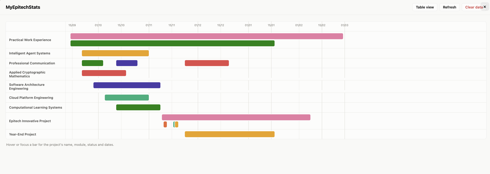

# MyEpitechStats

Extension Chrome vibecodeslop pour my epitech fais en 1 prompt
pour voir la timeline des projets
(pcq pourquoi je vais coder une vraie extension pour un intra mal vibecodé et aussi pq jferais un vrai readme à la main mdr bref)

Ce n'est pas un outil officiel d'Epitech, c'est un projet personnel.

ça ressemble à ça

  

## Installation (5 minutes, sans rien installer d'autre)

### 1. Télécharger le projet

- Va sur la page GitHub du projet.
- Clique sur le bouton vert **Code**, puis **Download ZIP**.
- Dézippe le fichier téléchargé (double-clique dessus, ou clic droit →
  "Extraire" / "Décompresser").

### 2. Activer le mode développeur de Chrome

- Ouvre Chrome et va à l'adresse : `chrome://extensions`
- En haut à droite, active l'interrupteur **Mode développeur**.

### 3. Charger l'extension

- Clique sur **Charger l'extension non empaquetée** (*Load unpacked*).
- Sélectionne le dossier **`dist`** qui se trouve à l'intérieur du dossier
  que tu as dézippé (pas le dossier principal, bien celui qui s'appelle
  `dist`).
- L'extension **MyEpitechStats** apparaît dans la liste, c'est fait.

Aucune installation de Node, npm ou autre n'est nécessaire : le dossier
`dist` contient déjà tout ce qu'il faut, prêt à l'emploi.

## Utilisation

1. Va sur [my.epitech.eu](https://my.epitech.eu).
2. Dans le menu de gauche, un nouvel onglet **Timeline** apparaît juste
   après "Projects".
3. Clique dessus : ta timeline s'affiche par-dessus la page.
4. Survole une barre colorée avec la souris pour voir le nom du projet, son
   module, son statut et ses dates.
5. Bouton **Table view** pour voir la même chose sous forme de tableau.

Plus tu navigues sur les pages "Projects" (Upcoming / Current / Past),
plus la timeline se remplit automatiquement — l'extension retient tout ce
qu'elle a déjà vu.

## Mes données sont-elles envoyées quelque part ?

Non. Tout reste dans ton navigateur (stockage local de Chrome). Rien n'est
envoyé sur internet. Voir [PRIVACY.md](PRIVACY.md) pour le détail.

## Mettre à jour l'extension

Quand une nouvelle version est disponible sur GitHub : retélécharge le ZIP,
dézippe-le, puis sur `chrome://extensions` clique sur l'icône de
rechargement (🔄) de l'extension MyEpitechStats — ou supprime l'ancienne et
recharge le nouveau dossier `dist` avec **Charger l'extension non
empaquetée**.

## Je veux modifier le code / contribuer

Voir [DEVELOPMENT.md](DEVELOPMENT.md).
